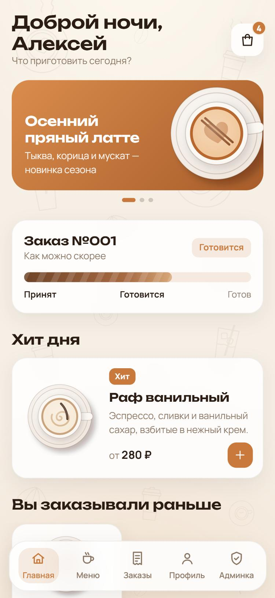
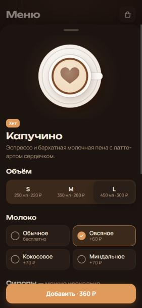
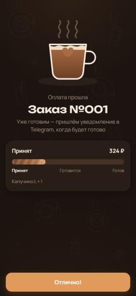

# ☕ «Зерно» — Telegram-бот кофейни с Mini App

Демо-проект для портфолио: бот кофейни, в котором можно выбрать напиток, собрать заказ,
«оплатить» его и посмотреть, как бариста его готовит. Есть AI-бариста и админка.

<p align="center">
  
  
  
</p>

> ⚠️ Оплата ненастоящая: деньги не списываются, это просто экран-имитация.

---

## 🚀 Как запустить (Windows, 3 шага)

Понадобится только **Python 3.12 или новее** — [скачать](https://www.python.org/downloads/).
При установке поставьте галочку **«Add python.exe to PATH»**.

### 1. Скачайте проект

Зелёная кнопка **Code** вверху страницы → **Download ZIP** → распакуйте архив в любую папку.

### 2. Вставьте токен своего бота

1. В Telegram откройте [@BotFather](https://t.me/BotFather), отправьте `/newbot` и придумайте имя боту.
2. BotFather пришлёт токен — строку вида `1234567890:AAH...`.
3. Откройте в папке проекта файл **`config.env`** (Блокнотом) и вставьте токен после `BOT_TOKEN=`:

   ```
   BOT_TOKEN=1234567890:AAH...
   ```

4. Сохраните файл.

### 3. Запустите

Дважды кликните **`start.bat`**.

Первый запуск займёт 1–2 минуты: скрипт сам установит всё нужное. Когда в окне появится
`Run polling for bot`, откройте своего бота в Telegram и нажмите **/start**.

**Готово — тыкайте, пробуйте!** ☕

> Бот работает, пока открыто чёрное окно `start.bat`. Закрыли окно — бот выключился.
> Чтобы включить снова, ещё раз запустите `start.bat`.

---

## 👆 Что попробовать

- **Меню** (кнопка внизу слева в чате) — выберите напиток, объём, молоко и сироп, добавьте в корзину и оформите заказ.
  Через несколько секунд бот напишет, что заказ готовится, а потом — что готов.
- **AI-бариста** — напишите боту, например: «хочу что-то холодное и не сладкое».
- **Админка** — вкладка «Админка» в Mini App: лента заказов, редактирование меню, промокоды, рассылки, статистика.
  В демо-режиме она открыта всем.
- **Мои заказы** и **Профиль** — история заказов, повтор заказа в одно касание, бонусная карта «6-й кофе в подарок».

## ❓ Если что-то не так

| Проблема | Решение |
|---|---|
| Окно пишет `Bot token is not set` | Токен не вставлен в `config.env` или файл не сохранён |
| Окно пишет `Python not found` | Установите Python и поставьте галочку «Add python.exe to PATH» |
| Mini App долго грузится или пишет «Не удалось загрузить» | Закройте Mini App и откройте снова. Бесплатный туннель иногда меняет адрес — бот подхватит новый сам |
| Бот не отвечает | Проверьте, что окно `start.bat` открыто и интернет работает |

**AI-бариста на Claude (необязательно).** Без ключа бариста подбирает напитки по встроенным правилам.
Чтобы отвечала нейросеть, вставьте ключ Claude API в `config.env` после `ANTHROPIC_API_KEY=`.

---

## Что внутри

- **Бот:** `/start`, `/orders`, `/help`, AI-бариста, уведомления о статусе заказа, напоминания, поздравление с днём рождения, антиспам
- **Mini App:** главная с акциями, меню с поиском, конструктор напитка, корзина с промокодами, экран оплаты, заказы, профиль; анимации в стиле Liquid Glass, светлая и тёмная тема
- **Админка:** заказы в реальном времени, меню и добавки, промокоды, рассылки по сегментам, статистика
- **Безопасность:** проверка подписи Telegram `initData`, пересчёт цены на сервере, лимиты на флуд и неоплаченные заказы

| Часть | Технологии |
|---|---|
| Бот | Python, aiogram 3, APScheduler |
| API | FastAPI, SQLAlchemy 2 (async), Pydantic |
| Mini App | React 19, Vite, TypeScript, Framer Motion, Zustand, `@telegram-apps/sdk` |
| Данные | PostgreSQL + Redis (на сервере) или SQLite + Redis в памяти (при запуске через `start.bat`) |
| AI | Claude API + встроенный подбор без ключа |

<details>
<summary><b>Для разработчиков: сервер, Docker, тесты</b></summary>

### Как устроен запуск через `start.bat`

Один процесс `backend/run_local.py` поднимает API, отдаёт собранный Mini App (`webapp/dist`), запускает бота
и планировщик. Telegram открывает Mini App только по HTTPS, поэтому скрипт поднимает бесплатный туннель
[localhost.run](https://localhost.run) через встроенный в Windows `ssh` и сам ставит его адрес в кнопку меню бота.

### Запуск на сервере (Docker)

```bash
cp .env.example .env      # заполните BOT_TOKEN, WEBAPP_URL, ADMIN_IDS и т.д.
docker compose up -d --build
sh scripts/init-letsencrypt.sh you@example.com   # HTTPS-сертификат для домена из DOMAIN
```

Сервисы: `api` (FastAPI), `bot` (aiogram), `nginx` (статика + HTTPS), `postgres`, `redis`, ежедневный бэкап БД.

### Разработка и тесты

```bash
cd backend
python -m venv .venv && .venv/Scripts/activate
pip install -r requirements-dev.txt
pytest

cd webapp
npm install
npm run dev      # http://localhost:5173
```

### Структура

```
backend/app/api       FastAPI: роуты Mini App и админки, проверка initData
backend/app/bot       aiogram: хендлеры, антиспам, планировщик
backend/app/services  цены, заказы, AI-бариста, рассылки, статистика
backend/run_local.py  запуск одной командой (start.bat)
webapp/src            Mini App на React
webapp/dist           собранный Mini App (чтобы для запуска не нужен был Node.js)
config.env            токен бота для запуска через start.bat
.env.example          все настройки для сервера
```

</details>
